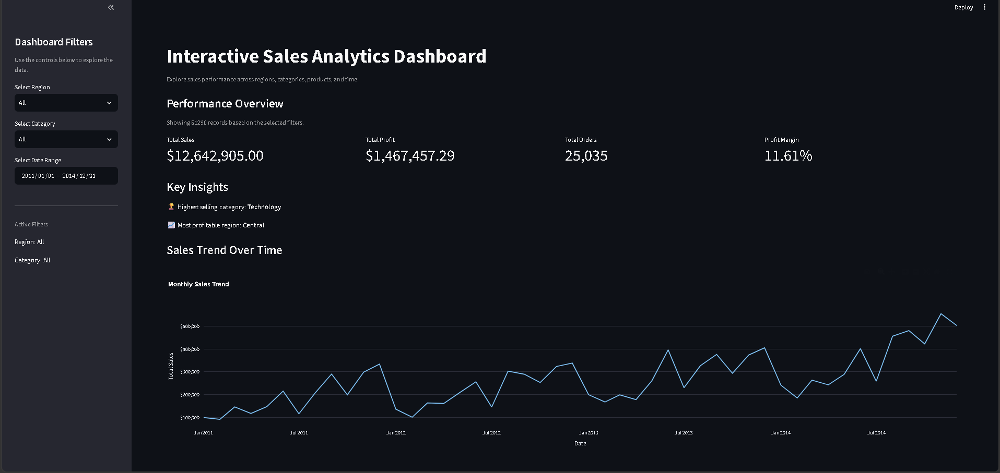
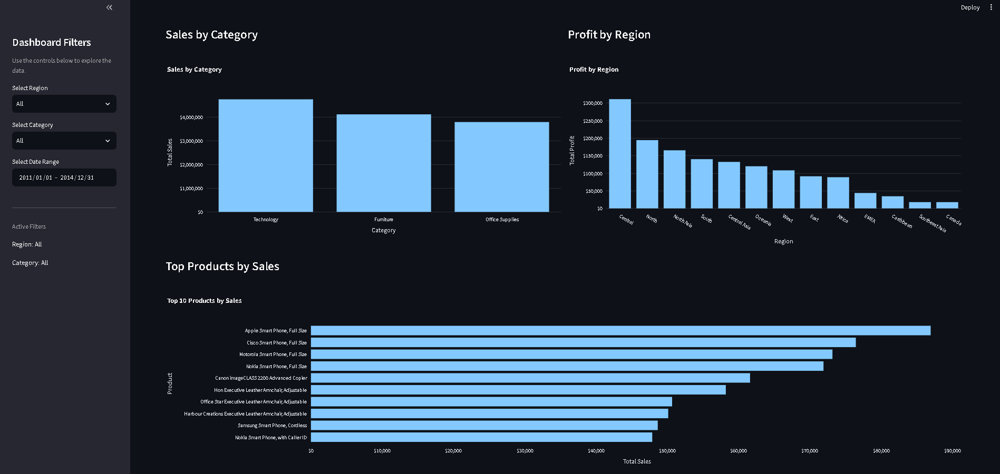
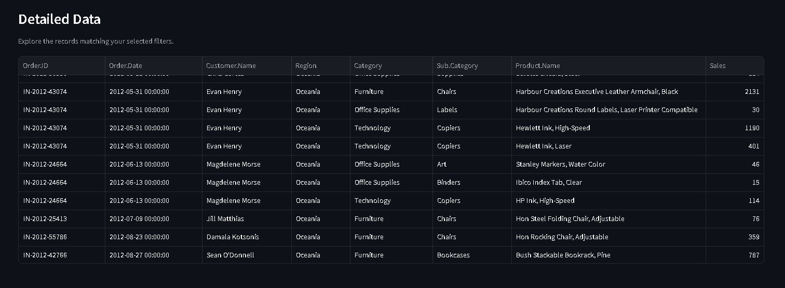

# 📊 Sales Analytics Dashboard

> Interactive business analytics dashboard built with Python, Pandas, Plotly, and Streamlit.

[](https://sales-analytics-dashboard-fhl2miiq2o4x6ka3ehvyey.streamlit.app/)
[](https://sales-analytics-dashboard-fhl2miiq2o4x6ka3ehvyey.streamlit.app/)
[](https://www.python.org/)
[](https://pandas.pydata.org/)
[](https://plotly.com/)

[🚀 Live Demo](https://sales-analytics-dashboard-fhl2miiq2o4x6ka3ehvyey.streamlit.app/) • [📂 GitHub Repository](https://github.com/tb9591803659-tech/sales-analytics-dashboard) • [👤 Author Profile](https://github.com/tb9591803659-tech)

---

## 📑 Table of Contents

- [Overview](#-overview)
- [Key Features](#-key-features)
- [Dashboard Screenshots](#-dashboard-screenshots)
- [Tech Stack](#-tech-stack)
- [Project Architecture](#-project-architecture)
- [Repository Structure](#-repository-structure)
- [File Responsibilities](#-file-responsibilities)
- [Dataset & Validated Business Metrics](#-dataset--validated-business-metrics)
- [Data Cleaning & Validation Pipeline](#-data-cleaning--validation-pipeline)
- [Reproducible Data Preparation](#-reproducible-data-preparation)
- [Local Installation & Setup](#-local-installation--setup)
- [Deployment Details](#-deployment-details)
- [Design Decisions](#-design-decisions)
- [Project Goals](#-project-goals)
- [Learning Outcomes](#-learning-outcomes)
- [Repository Hygiene](#-repository-hygiene)
- [Project Status](#-project-status)
- [Future Improvements](#-future-improvements)
- [Contributing](#-contributing)
- [Issues & Feedback](#-issues--feedback)
- [Author](#-author)
- [License](#-license)
- [Acknowledgements](#-acknowledgements)

---

## 📌 Overview

The **Sales Analytics Dashboard** is an end-to-end data analytics application built using **Python, Pandas, NumPy, Plotly, and Streamlit**. It transforms raw retail transaction data into actionable business intelligence through dynamic KPIs, multi-dimensional filters, trend visualizations, and deep-dive tables.

Rather than running ad-hoc scripts or directly graphing raw CSV files, this project executes a disciplined engineering pipeline:

$$\text{Raw Data} \longrightarrow \text{Cleaning} \longrightarrow \text{Validation} \longrightarrow \text{Analysis} \longrightarrow \text{Visualization} \longrightarrow \text{Interactive Dashboard} \longrightarrow \text{Deployment}$$

The project emphasizes **defensive data validation**, **modular code separation**, **reproducible pipelines**, and **resilient cloud deployment**.

---

## ✨ Key Features

- **Dynamic KPI Overview:** Evaluates core revenue metrics in real time:
  - **Total Sales:** Aggregate revenue formatted in standard currency.
  - **Total Profit:** Overall bottom-line net return.
  - **Total Orders:** Unique transaction count across the enterprise.
  - **Profit Margin:** Percentage margin dynamically updated per filter context.
- **Interactive Multi-Parameter Filters:**
  - Regional segmentation selection.
  - Granular date range picker.
  - Cross-filtering guarantees all visual components, KPIs, and summaries update cohesively.
- **Adaptive Sales Trend Engine:**
  - Displays a **Monthly Sales Trend** when analyzing broad date ranges.
  - Automatically switches to a **Daily Sales Trend** when filtering windows are 31 days or fewer, avoiding aggregated visual flattening.
- **Categorical Revenue Analysis:** Interactive Plotly bar chart mapping volume across product categories.
- **Regional Profitability Breakdown:** Comparative analysis uncovering profit concentrations and regional underperformance.
- **Top Product Rankings:** Horizontal bar chart highlighting the top 10 revenue-generating products.
- **Automated Contextual Insights:** Dynamic summary metrics identifying the highest-selling category, top-performing product, and most profitable region directly within the selected view.
- **Detailed Tabular Exploration:** Interactive data grid displaying transactional granularity (`Order.ID`, `Order.Date`, `Customer.Name`, `Region`, `Category`, `Sub.Category`, `Product.Name`, and `Sales`).

---

## 📸 Dashboard Screenshots

### 1. Dashboard Overview
The primary command center showcasing high-level KPI cards, interactive filters, contextual insights, and adaptive revenue timelines.



---

### 2. Sales & Product Analysis
Visual analytics breaking down revenue by category, regional profitability spreads, and the top 10 products by sales volume.



---

### 3. Detailed Data
Interactive data explorer allowing users to inspect individual transaction records corresponding to active filter conditions.



---

## 🛠️ Tech Stack

| Technology | Role & Purpose |
|---|---|
| **Python** | Primary programming language used for end-to-end development |
| **Pandas** | High-performance data structures, transformation, group aggregations, and cleaning |
| **NumPy** | Numerical operations |
| **Plotly** | Declarative, interactive data visualizations with hover cards and dynamic axes |
| **Streamlit** | Interactive UI state handling, reactive component rendering, and caching |
| **Git & GitHub** | Source code management, semantic version control, and collaborative tracking |
| **Streamlit Community Cloud** | Continuous cloud deployment and live application hosting |

---

## 🧠 Project Architecture


                         RAW DATA
                            │
                            ▼
                  ┌──────────────────┐
                  │ data/            │
                  │  superstore.csv  │
                  └──────────────────┘
                            │
                            ▼
                  ┌──────────────────┐
                  │   Data Loading   │
                  │src/data_loader.py│
                  └──────────────────┘
                            │
                            ▼
                  ┌──────────────────┐
                  │  Data Cleaning   │
                  │  src/cleaner.py  │
                  └──────────────────┘
                            │
                            ▼
                  ┌──────────────────┐
                  │ Data Validation  │
                  │  src/cleaner.py  │
                  └──────────────────┘
                            │
                            ▼
                  cleaned_data.csv
                  (Generated/Ignored)
                            │
                            ▼
                  ┌──────────────────┐
                  │  Data Analysis   │
                  │ src/analysis.py  │
                  └──────────────────┘
                            │
                            ▼
                  ┌──────────────────┐
                  │  Visualization   │
                  │src/visualizat... │
                  └──────────────────┘
                            │
                            ▼
                  ┌──────────────────┐
                  │  Streamlit App   │
                  │     app.py       │
                  └──────────────────┘
                            │
                            ▼
                     LIVE DASHBOARD

---

## 📁 Repository Structure
```text
Sales Analytics Dashboard/
│
├── data/
│   └── superstore.csv
│
├── screenshots/
│   ├── dashboard-charts.png
│   ├── dashboard-data.png
│   └── dashboard-overview.png
│
├── src/
│   ├── __init__.py
│   ├── analysis.py
│   ├── cleaner.py
│   ├── data_loader.py
│   └── visualization.py
│
├── .gitignore
├── app.py
├── prepare_data.py
├── README.md
└── requirements.txt
```

## ⚙️ File Responsibilities

| File / Module | Core Responsibilities |
|---|---|
| **`app.py`** | Main Streamlit web application interface. Manages dashboard layout, sidebar interactive filters, KPI metrics, dynamic rendering of Plotly charts, key business insights, filtered tabular data exploration, and deployment-safe on-the-fly generation of cleaned data if absent. |
| **`prepare_data.py`** | Standalone, reproducible data preparation script. Executes the automated batch pipeline: loads raw dataset $\rightarrow$ cleans records $\rightarrow$ validates data integrity $\rightarrow$ exports validated output to `data/cleaned_data.csv`. |
| **`src/data_loader.py`** | Ingests CSV files into Pandas DataFrames, standardizes and converts `Order.Date` and `Ship.Date` to valid datetime types, and handles loading exceptions. |
| **`src/cleaner.py`** | Handles data cleaning, missing-value audits, duplicate row removal, business-rule validation, schema integrity checks across all 27 required columns, and pre-visualization assertions. |
| **`src/analysis.py`** | Pure analytical functions computing core metrics: total sales, total profit, total unique orders, profit margin percentage, sales by category, profit by region, top products, monthly sales aggregations, and daily sales aggregations. |
| **`src/visualization.py`** | Reusable Plotly visualization functions: adaptive daily/monthly sales trend lines, categorical sales bar charts, regional profitability bar charts, and top products horizontal bar charts. |

## 📊 Dataset & Validated Business Metrics

Following the cleaning and validation pipeline, the clean dataset contains **51,290 records** across **27 columns**. The project verifies dataset integrity through automated business rules and summary metrics rather than visualizing unverified raw data.

### Core Business Metrics

| Business Metric | Validated Numerical Value | Formatted Display Metric |
|---|---|---|
| **Total Sales** | 12,642,905[cite: 7] | **$12,642,905.00** |
| **Total Profit** | 1,467,457.29128[cite: 7] | **$1,467,457.29** |
| **Total Quantity Sold** | 178,312[cite: 7] | **178,312 units** |
| **Total Orders** | 25,035[cite: 7] | **25,035 orders** |
| **Total Unique Customers** | 4,873[cite: 7] | **4,873 customers** |
| **Total Products Sold** | 10,292[cite: 7] | **10,292 products** |
| **Average Discount** | 0.1429075453[cite: 7] | **14.29%** |
| **Total Shipping Cost** | 1,352,815.7034[cite: 7] | **$1,352,815.70** |

---

## 🔍 Data Cleaning & Validation Results

The automated validation run checks for structural completeness, nulls, duplicates, and logical value distributions:

| Validation Parameter | Result / Count | Evaluation Notes |
|---|---|---|
| **Missing Values** | `0`[cite: 7] | Fully populated across all required columns[cite: 7]. |
| **Duplicate Rows** | `0`[cite: 7] | Deduplication pass complete[cite: 7]. |
| **Negative Sales** | `0`[cite: 7] | No negative revenue entries found[cite: 7]. |
| **Zero Sales** | `1`[cite: 7] | Single zero-sales record identified[cite: 7]. |
| **Negative Profit** | `12,544`[cite: 7] | Valid business characteristic representing loss-making transactions (due to high discounts/shipping costs) rather than data errors. |
| **Zero Profit** | `668`[cite: 7] | Break-even orders[cite: 7]. |
| **Negative Quantity** | `0`[cite: 7] | Non-negative quantity rules satisfied[cite: 7]. |
| **Zero Quantity** | `0`[cite: 7] | All transactions contain positive unit counts[cite: 7]. |
| **Maximum Discount** | `0.85` | Validated within acceptable discount threshold boundaries ($\le 85\%$). |
| **Order Date Validity** | `Yes` (`datetime64`)[cite: 7] | Successfully converted and verified[cite: 7]. |
| **Ship Date Validity** | `Yes` (`datetime64`)[cite: 7] | Successfully converted and verified[cite: 7]. |

<details>
<summary><b>Required Schema Columns (27 Verified Attributes)</b></summary>

Category, City, Country, Customer.ID, Customer.Name, Discount, Market, Total.Orders,
Order.Date, Order.ID, Order.Priority, Product.ID, Product.Name, Profit, Quantity,
Region, Row.ID, Sales, Segment, Ship.Date, Ship.Mode, Shipping.Cost, State,
Sub.Category, Year, Market2, weeknum

## 💻 Local Installation & Setup

Complete step-by-step instructions to set up, prepare data, and run the application locally on Windows, macOS, or Linux.

---

### Clone the Repository

Clone the project from GitHub and navigate into the project directory:

```bash
git clone [https://github.com/tb9591803659-tech/sales-analytics-dashboard.git](https://github.com/tb9591803659-tech/sales-analytics-dashboard.git)
cd sales-analytics-dashboard
```

# Create virtual environment
python -m venv .venv

# Activate virtual environment
.venv\Scripts\activate

# Create virtual environment
python3 -m venv .venv

# Activate virtual environment
source .venv/bin/activate

# Install required dependencies
pip install -r requirements.txt

# Run Data Preparation Pipeline
python prepare_data.py

# Launch the Streamlit Dashboard
streamlit run app.py

## 👨‍💻 Author

**Shashank T**  
*AI & Data Science Student | Aspiring AI Engineer*

- **GitHub:** [@tb9591803659-tech](https://github.com/tb9591803659-tech)
- **Project Repository:** [sales-analytics-dashboard](https://github.com/tb9591803659-tech/sales-analytics-dashboard)
- **Live Dashboard:** [Streamlit Community Cloud](https://sales-analytics-dashboard-fhl2miiq2o4x6ka3ehvyey.streamlit.app/)

**Interests & Focus Areas:**
- Artificial Intelligence & Machine Learning
- Data Science & Business Analytics
- Software Engineering & Clean Architecture
- Competitive Programming
- Building practical, production-ready tech solutions

---

## 📄 License

This project is currently intended and maintained for **educational and portfolio demonstration purposes**.

The Superstore sales dataset utilized in this project may be subject to the terms, conditions, and copyright of its original source.

---

## 🙏 Acknowledgements

- [Python](https://www.python.org/)
- [Pandas](https://pandas.pydata.org/)
- [NumPy](https://numpy.org/)
- [Plotly](https://plotly.com/)
- [Streamlit](https://streamlit.io/)
- [Git](https://git-scm.com/) & [GitHub](https://github.com/)
- [Streamlit Community Cloud](https://streamlit.io/cloud)
- The global open-source Data Science and Analytics community

---

## ⭐ Support

If you found this project helpful, informative, or inspiring for your own portfolio work, please consider giving this repository a **Star** on [GitHub](https://github.com/tb9591803659-tech/sales-analytics-dashboard)!

